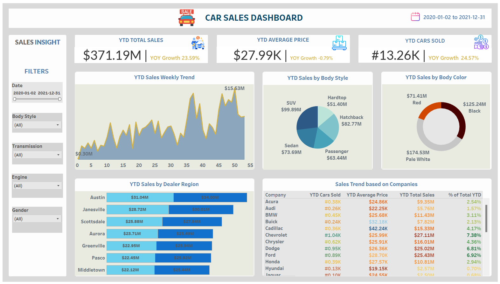

# 🚗 Car Sales Dashboard – Tableau Project

This project presents an interactive **Car Sales Dashboard** built in **Tableau Public** to visualize and analyze car sales data over a year-long period. It provides insights into total sales, average vehicle price, popular body styles, sales by dealer region, and company-wise performance.

---

## 📊 Project Overview

**Objective:**  
To build an interactive and visually engaging dashboard to help stakeholders track key car sales metrics, understand regional and category trends, and make data-informed decisions.

**Tools Used:**  
- Tableau Public  
- Microsoft Excel (for data cleaning)  
- PowerPoint (icons and layout preparation)

---

## 📌 Key Features

- **YTD Total Sales**: $371.19M with **23.59% YoY growth**
- **YTD Average Price**: $27.99K, a slight decrease of **0.79% YoY**
- **YTD Cars Sold**: 13.26K units, a **24.57% YoY increase**
- **Sales by Body Style**: SUV leads with $99.89M, followed by Hatchback and Sedan
- **Sales by Color**: Pale White cars dominate the market at $174.53M
- **Regional Breakdown**: Austin and Janesville are the top dealer regions
- **Company Trends**:
  - **Chevrolet**, **Ford**, and **Chrysler** contribute significantly to total YTD sales
  - Acura, Audi, and Dodge show lower sales volumes
- **Weekly Sales Trends**: Clear seasonality and sales spikes, peaking around week 45

## 📈 Insights & Impact

- High-performing regions and vehicle types can help inform future inventory and marketing strategies.
- YOY performance metrics help stakeholders evaluate annual progress.
- Body color preferences and style trends offer cues for design and production.
- Company-wise breakdown supports competitor analysis and brand-level decisions.

---

## 🔗 Live Dashboard (Optional)

> 🌐 View the interactive version on [Tableau Public](https://public.tableau.com/views/sale_car/Dashboard2?:language=en-US&publish=yes&:sid=&:redirect=auth&:display_count=n&:origin=viz_share_link)  
*(Insert actual link once published)*

---

## 📬 Contact

**Sudeshna Mondal**  
📍 Calgary, Alberta  
✉️ sudeshna.buie@gmail.com  
🔗 [LinkedIn Profile](https://www.linkedin.com/in/dr-sudeshna-mondal/)
